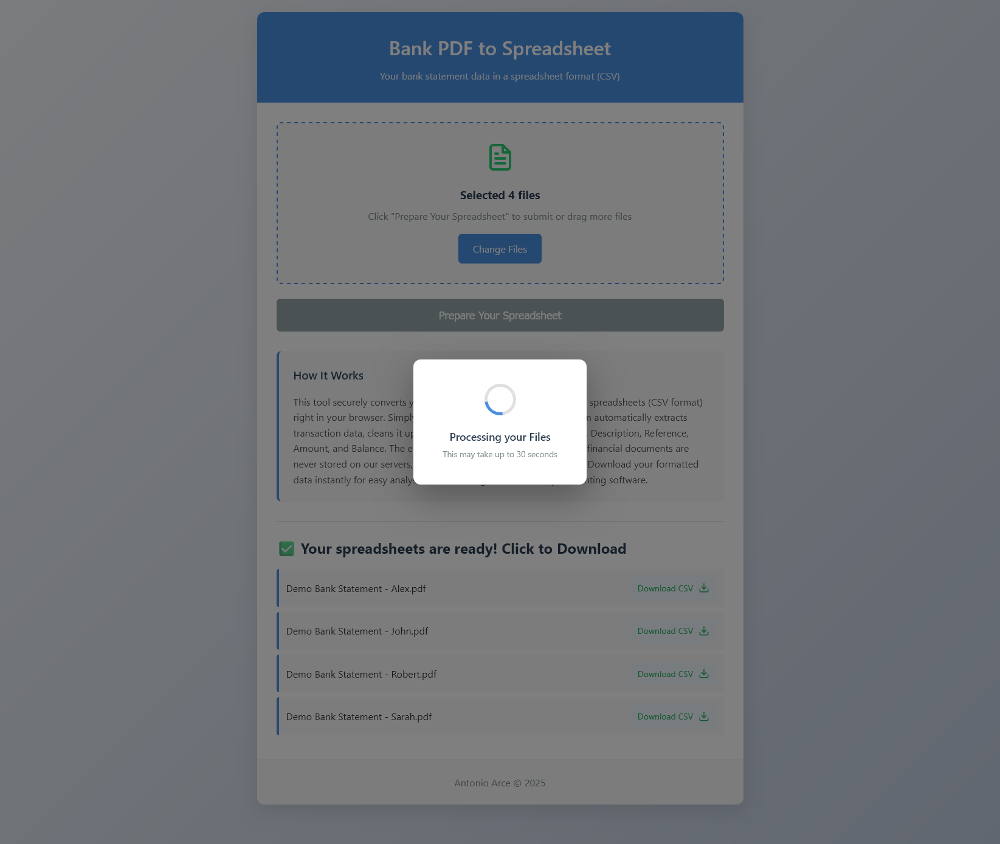

# Bank PDF to CSV Converter

A secure web application that converts bank statement PDFs into structured CSV files with privacy-first design.

## Demo

[](https://www.youtube.com/watch?v=1vmPoUhqtUk)

_Click the image above to watch the demo on YouTube_


_Loading indicator shown while the PDF is being processed_

## Features

- **Secure Processing**: Files are processed entirely in memory - never stored on disk
- **Multiple File Support**: Upload and convert multiple PDFs simultaneously
- **Privacy Focused**: Automatic session expiration and no data persistence
- **Modern Interface**: Drag-and-drop upload with responsive design
- **High Quality Output**: Clean, structured CSV format for financial analysis

## Technology Stack

- **Backend**: Python with Flask
- **PDF Processing**: pdfplumber with custom regex parsing
- **Frontend**: Vanilla JavaScript with modern CSS
- **Package Management**: UV (fast Python package manager)
- **Security**: Session-based storage with file validation

## Installation

1. **Install UV** (if not already installed):

```bash
curl -LsSf https://astral.sh/uv/install.sh | sh
```

2. **Clone and setup**:

```bash
git clone git@github.com:TheHungryGuy/Python-PDF-to-CSV.git
cd Python-PDF-to-CSV
uv sync
```

3. **Set your Datalab API key**:

```bash
echo "DATALAB_API_KEY=your_key_here" > .env
```

## Usage

1. **Start the application**:

```bash
uv run python app.py
```

2. Open your browser to http://localhost:5000

3. Drag and drop bank statement PDFs or click to browse

4. Download converted CSV files instantly

## Security Features

- ✅ File type validation (PDF only)

- ✅ Size limits (16MB max per file)

- ✅ Session-based storage (no disk writing)

- ✅ Automatic session expiration (1 minute)

- ✅ Secure filename handling

- ✅ No third-party data sharing
